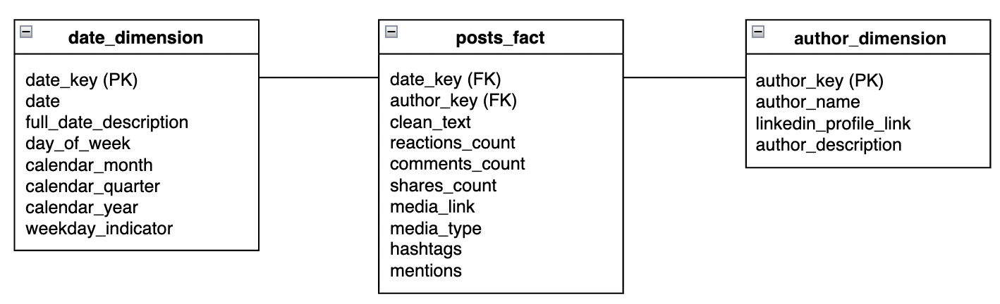
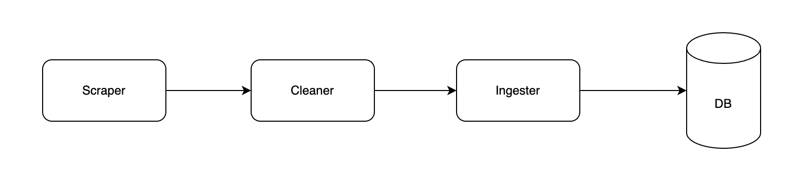

# Linkedin Curator


## Updates - 07/09/2022

### Progress
:white_check_mark: Migrated the local PostgreSQL database to a cloud database using AWS RDS.\
:white_check_mark: Redesigned the database schema to follow a dimensional model structure.\
:white_check_mark: Posts from new authors will be added to the scrape.\
:x: More authors are needed considering each only produces a handful of posts per week. The current size of the database is still too small do conduct any meaningful analysis.\
:x: No progress has been made to the analysis side. New functions will be added to the Colab notebook to connect to the database and extract the data from there.\
:x: No plans on what to analyze. Essentially, this is the project proposal.

### New database model



Our database will consist of three tables, two dimension tables and one fact table. It is fairly simple to understand the relationships between these three tables. There are no primary keys in the `posts_fact` table. Instead, we have two foreign keys: `date_key` which is the primary key of `date_dimension` table and `author_key` which is the primary key of `author_dimension` table. The reason is because in a dimensional model, the general idea is to access the fact table via its dimension tables, so we always start our query from the dimension tables. Also, we still gurantee the uniqueness of the rows in the fact table by creating a composite primary key. In this case, `author_key` and `clean_text` are set to be unique as a combination. In other words, we don't want to to store the same post of the same author in our database.

Our analysis will be using data from these three tables. The texts have already been cleaned and preprocessed enough for simple analysis. For example, you can now write a simple aggregation query in SQL to get the top 10 most popular hashtags in our database. More complicated analysis will require further text manipulation.

### Colab notebook
https://colab.research.google.com/drive/1dWvhGQCg9xHYk5ABxw0TIhE3kIRwO0gP

### TODO list
1. Add more authors to the `author_dimension` table so that our fact table and expand in size more rapidly.
2. Come up with what we want to analyze. Essentially, build the project proposal.
3. Start building the Colab notebook.

---

## 1. Goal
Periodly and automatically extract and curate Linkedin posts that are relevant to recruitment information of interest. The posts will be cleaned and converted into row-based data that will be stored in a PostgreSQL database. The data then can be queried and analyzed by end-users.

## 2. Current System Infra



The current system infrastructure has four main sections:
- **The Scraper**: the name says it all. It scrapes the very raw data from Linkedin.
- **The Cleaner**: the raw data will be cleaned here. Also, all of the pre-processing steps take place here. The structure of our data model (in other words, our database schema) heavily influences how we decide to clean and pre-process the raw data at this stage. The goal is to make the data fit into the database. There constraints that we have set up in our tables, and any data that will be coming into them will have to satisfy all of such constraints. Having said that, the current pre-processing steps are fairly simple.
- **The Ingester**: the processed data will be ingested into the database. This is where we connect to the database using our credentials (host, username, password, port, etc.). After successfully connecting to the database, we move the data into the corresponding tables that we have already set up in our database. If the data is correctly cleaned and pre-processed, the ingestion should be executed without any issue.
- **Database**: this is a local database. We may need to put it on a cloud service so that we can all get access to it. We are having seven tables and one schema right now in our database. In PostgreSQL, a database can contain many schemas, and each schema is the blueprint for a group of tables. In other words, when you say "I get access to the data inside a database", it usually means that you connect your script to the Server - can be local like the current database, or it can be on a cloud service like AWS - then go into a database, then go into a schema, and then go into a table. This is where you find the data. 

## 3. The Code
First, you wanna look at the structure of the whole repo. In short, the main code will be inside the `src` folder. The `logs` folder contains one file that stores the log events as our program runs. The `sql_queries` folder stores the SQL queries that can be used later for playing around with the data in the database - they don't play any role in the ingestion run. The program will be run by executing `run_pipeline.sh` shell script on your command line interface:

```
./run_pipeline.sh
```

You may need to change the permission for this shell script first:

```
chmod +x run_pipeline.sh
```

The shell script will automatically open a virtual environment, run the program in it, then close the environment. It makes sure the program gets all the packages it needs to be successfully executed in each run.

The `common_utils.py` file inside the `src` folder is where we store the common utilities that are used throughout the whole system. "Common utilities" is just another phrase for functions that we reuse a lot. These functions don't exclusively belong to any classes or functions, thus defining them inside a class or function is not reasonable. To improve the reusability, visibility, and for the sake of debugging, these functions will be defined in a separate script. `common_utils` can be considered as a package that we build ourselves. Any new functions that we add to this package needs to be unit-tested in `src/test/common_utils_test.py`. The test can be run by executing:

```
./run_common_utils_test.sh
```

You may need to change the permission first.

```
chmod +x run_common_utils_test.sh
```

## 4. Suggested Improvement
- **Suggestion #1**: Pipeline-wise saying, we can make changes right from the beginning of the pipeline: how we extract the data from Linkedin. Right now, the data we extract depends on a static list of profile URLs and names stored in the database. In other words, we have to manually insert the URL and name of a Linkedin user into our database before we can run the pipeline and get his/her data from Linkedin. It is too complicated to keep it this way. We shouldn't have to manually insert anything to the database.
- **Suggestion #2**: Make changes to our data model. This is natural because of two reasons. Firstly, if we follow a different data scraping logic according to Suggestion 1, then a new data model is, without questions, required to accommodate the new data since new attributes will be introduced along with the new logic. Secondly, the current database schema doesn't follow any standard design, which makes it difficult to maintain, debug, and make changes to the structure in general. We can follow the *dimensional modeling* technique, or in simpler words, we can adopt the *star schema*, which is a very popular schema in RDMS. We will have one fact table and multiple dimension tables. Read more [here](https://stackoverflow.com/questions/20036905/difference-between-fact-table-and-dimension-table). The benefits are: delivered data will be more understandable to both business users and developers and faster query performance. A data model that starts simple has a chance of remaining simple at the end of the design.
- **Suggestion #3**: Migrate the local database to a cloud database. We can work with a free-tier AWS account and make use of the AWS RDS service.
- **Suggestion #4**: For the sake of this course, we should build some kind an end-user interface to show that we can extract and do analysis upon the data inside our database. Without this, the professor may question the actual value of our project. The existence of a database, in the end, is to serve the analytical purposes of the business users. A notebook will work just fine I think.
- **Suggestion 5**: We should find a better way to automate the pipeline run. I'm using cronjob right now, but moving to a cloud database may require a different approach.


Priority rank: 3-1-2-5-4
